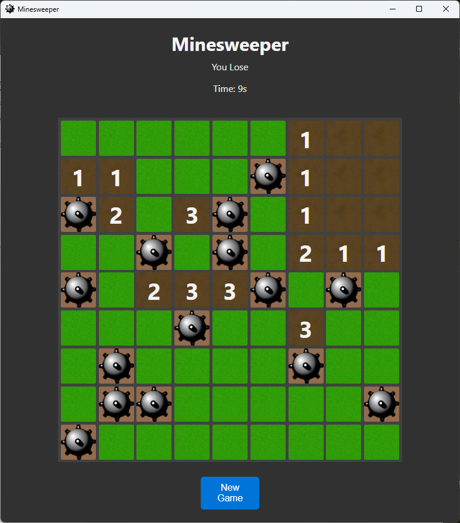
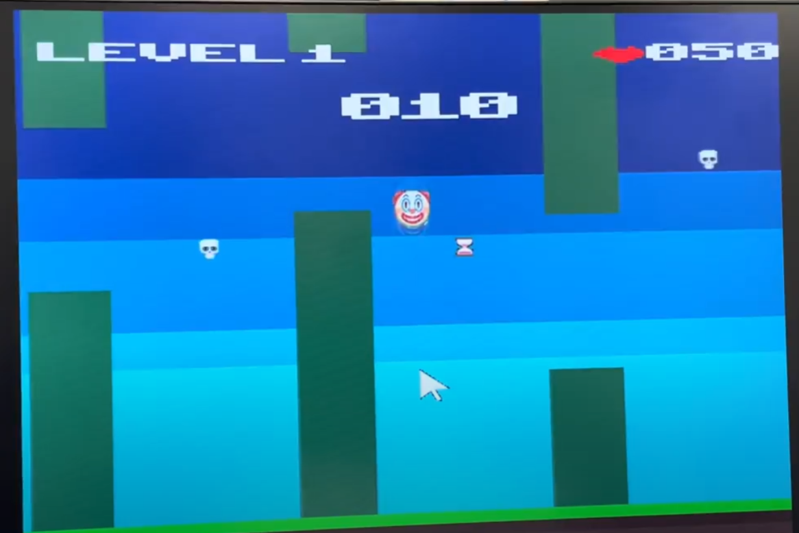

# Portfolio
## A few of my projects throughout my university career- and some just for fun! 
Feel free to look at my projects! How to start or run instructions will be in their associated readMes. Thanks! Below are a few screenshots of my projects!

## Machine Learning ASL Interpreter

## MinesweeperJS

## My 2D Adventure Game

## FPGA Flappy Bird
