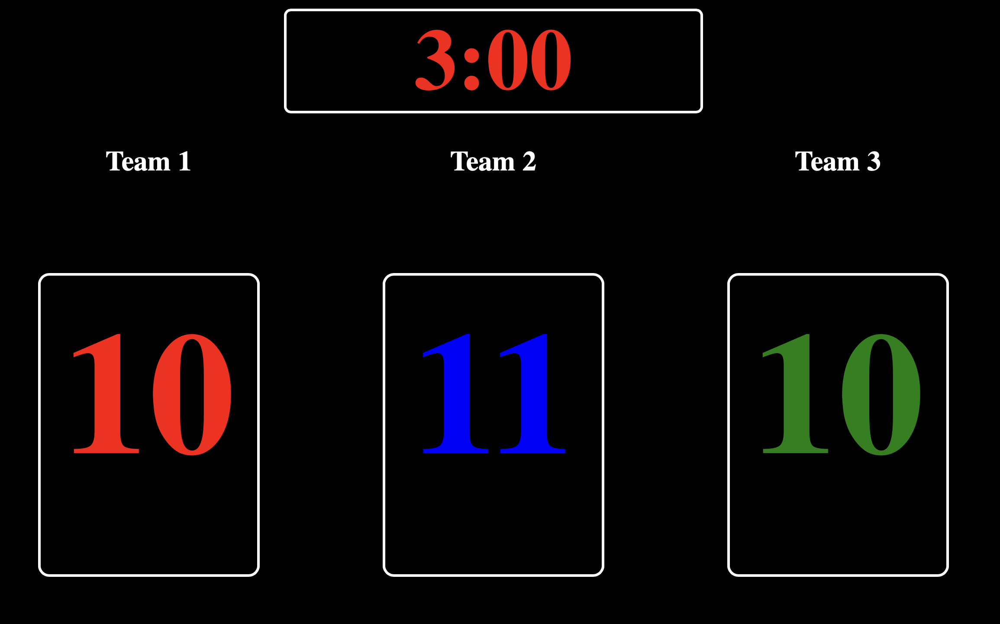

# Scoreboard Timer Application
This is a personal project for a church programme I'm apart of. This is a Bucket Toss Scoreboard, created so that the audience can be as involved as possible. It was inspired by an American Basketball scoreboard aesthetic. 

This is a simple scoreboard timer application built using HTML, CSS, and JavaScript. The application features a countdown timer, three score displays for different teams, and event listeners to increment scores using keyboard keys. 

## Features:
- Countdown Timer: The application displays a countdown timer in minutes and seconds format. The timer starts at 3 minutes and counts down to 00:00.

- Score Display: There are three score displays, each representing a different team. The scores can be incremented using the keyboard keys '1', '2', and '3'.

- Event Listeners: Event listeners are set up to detect keydown events for keys '1', '2', and '3'. When these keys are pressed, the corresponding team's score is incremented by one.

## How to use:
- Increment Scores: Press the keys '1', '2', or '3' on your keyboard to increment the scores for teams 1, 2, or 3, respectively.
## File Structure:
- index.html: Contains the HTML structure of the application.
- style.css: Defines the styles for the application elements.
- scripts.js: Contains the JavaScript code responsible for the countdown timer, score increment functionality, and event listeners.
## How to Run:
1. Download or clone the repository to your local machine.
2. Open the index.html file in a web browser.
## Notes:
1. The timer starts automatically when the page is loaded.
2. Scores can be incremented using the keyboard keys as mentioned above.
3. The countdown timer resets to 00:00 after reaching zero. Optionally, you can play a sound when the timer reaches zero by uncommenting the corresponding lines of code in the JavaScript file.

Enjoy using the Scoreboard Timer Application!