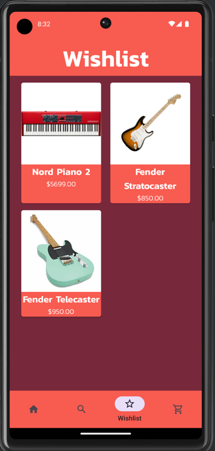
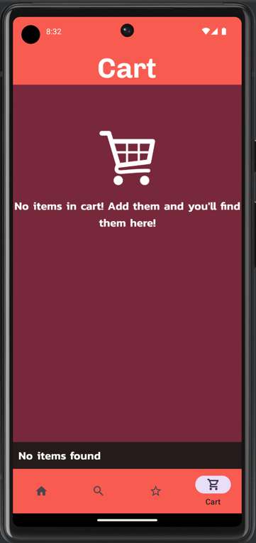

# CS302 Project: MONKEY WRENCH MUSIC
Ian Kuik & Jerome Jose

# About
Using Android Studio, we created an application prototype for a 
musical instrument/ accessories shopping app. 

# Features
- Item List of 6 categories with 30 items each.
- Home view, item list view, wishlist and cart view, search views and activities.
- Wishlist functionality.
- Product Search and Filter functions.
- Cart functionality.
- Expanded item view with descriptions and technical specifications.
- Featured top selling products.
- Scrolling animations.
- Fully resizable across different sized phones.
- Horizontal and Vertical orientations supported.

# Screenshots

