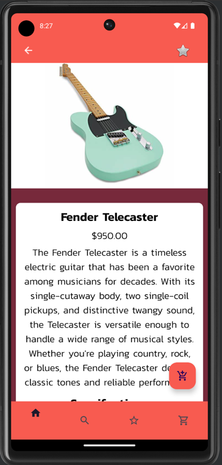

# COMPSYS302 Project 2 - MONKEY WRENCH
Ian Kuik & Jerome Jose

# About
Using AndroidStudio, we created an application that acts as a musical instrument shopping app that 
allows users to view items provided from a generated database and be able to wishlist & add 
the item to a cart. 

# Features
- Item List of 6 categories with 30 items each.
- Wishlist functionality.
- Product Search and Filter functions.
- Cart functionality.
- Expanded item view with descriptions and technical specifications.
- Featured top selling products.
- Scrolling animations.
- Fully resizable across different sized phones.
- Horizontal and Vertical orientations supported.

# Screenshots

